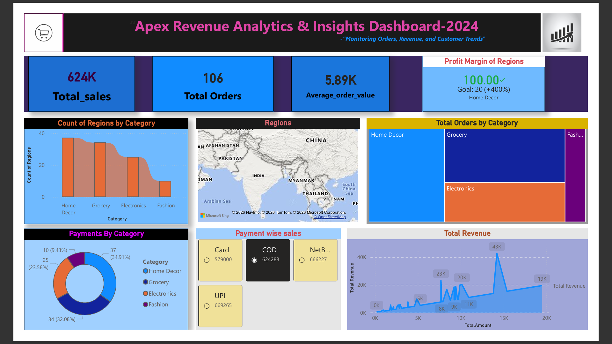

# Apex Revenue Analytics & Insights Dashboard 2024

## Problem Statement

Apex aims to monitor and improve its sales performance by analyzing customer orders, revenue generation, product categories, payment methods, and regional trends. However, raw transactional data makes it difficult to quickly identify business opportunities, high-performing categories, and revenue patterns.

The challenge is to transform sales data into actionable insights through an interactive dashboard that supports data-driven decision-making.

---

## Project Overview

The Apex Revenue Analytics & Insights Dashboard is an Excel-based business intelligence project designed to analyze sales transactions for the year 2024.

The dashboard provides a comprehensive view of:

- Revenue Performance
- Order Trends
- Regional Analysis
- Category-wise Sales
- Payment Method Analysis
- Key Business KPIs

By combining multiple datasets into a single interactive dashboard, users can quickly understand business performance and identify areas for growth.

---

## Project Objectives

- Track total sales revenue across the business.
- Monitor total customer orders.
- Analyze average order value.
- Compare category-wise sales performance.
- Evaluate regional business performance.
- Identify preferred payment methods.
- Provide management with actionable business insights.
- Create an interactive and visually appealing dashboard.

---

## Dataset Structure

The project uses two datasets:

### 1. Orders_2024_Jan_Jun.csv
Contains sales transactions from January to June 2024.

### 2. Orders_2024_Jul_Dec.csv
Contains sales transactions from July to December 2024.

### Dataset Columns

| Column Name | Description |
|------------|-------------|
| OrderID | Unique order identifier |
| OrderDate | Date of order |
| CustomerID | Unique customer identifier |
| CustomerName | Customer name |
| Region | Sales region |
| ProductID | Product identifier |
| ProductName | Product name |
| Category | Product category |
| Quantity | Units sold |
| Price | Product price |
| TotalAmount | Revenue generated |
| PaymentMethod | Mode of payment |

---

## Dashboard & Visualizations

The dashboard includes the following visualizations:

### KPI Cards
- Total Sales
- Total Orders
- Average Order Value
- Profit Margin Indicator

### Charts & Analysis
- Count of Regions by Category
- Category-wise Order Distribution (Treemap)
- Payment Category Distribution (Donut Chart)
- Payment-wise Revenue Analysis
- Revenue Trend Analysis (Line Chart)
- Regional Sales Mapping

### Interactive Features
- Dynamic visual reporting
- Category-level analysis
- Regional performance comparison
- Payment method insights

---

## Project Explanation

The project combines sales data from multiple periods and transforms it into meaningful business insights using Excel's analytical capabilities.

Key steps performed:

1. Data Collection
2. Data Cleaning
3. Data Transformation
4. KPI Calculation
5. Dashboard Design
6. Business Insight Generation

The dashboard helps stakeholders understand:

- Which categories generate maximum orders.
- Which payment methods contribute the most revenue.
- Regional sales performance.
- Revenue trends throughout the year.
- Customer purchasing behavior.

---

## Key Features

✅ Interactive Sales Dashboard

✅ Revenue Trend Analysis

✅ Category-wise Performance Tracking

✅ Regional Sales Analysis

✅ Payment Method Insights

✅ KPI Monitoring

✅ Business Intelligence Reporting

✅ Data Visualization Techniques

---

## Analysis Tools

This project was developed using:

- Microsoft Excel
- Pivot Tables
- Pivot Charts
- Conditional Formatting
- KPI Cards
- Treemap Visualization
- Donut Charts
- Geographic Map Visualization
- Data Cleaning Techniques

---

## Getting Started

### Clone Repository

```bash
git clone https://github.com/chavaganinagendrababu-ctrl/Apex_Sales_Dashboard.git
```

### Open Files

1. Download the repository.
2. Open the Excel dashboard file.
3. Explore the dashboard visuals and KPIs.
4. Review the datasets for detailed analysis.

---

## Project Insights

Some key business insights derived from the dashboard:

- Home Decor contributes significantly to overall sales.
- Multiple payment methods contribute to revenue generation.
- Revenue trends reveal peak sales periods.
- Category-wise order analysis helps identify top-performing segments.
- Regional analysis highlights business concentration areas.

---

## Dashboard Preview



---

## Contributing

Contributions, suggestions, and improvements are welcome.

Steps:

1. Fork the repository.
2. Create a new feature branch.
3. Commit your changes.
4. Push to your branch.
5. Create a Pull Request.

---

## License

This project is licensed under the MIT License.
